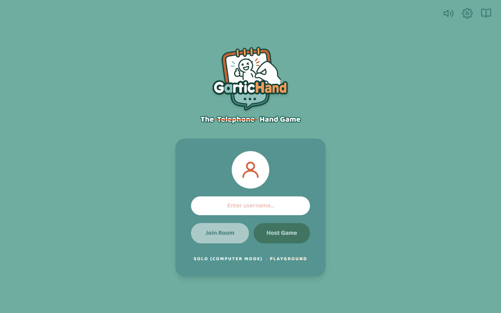
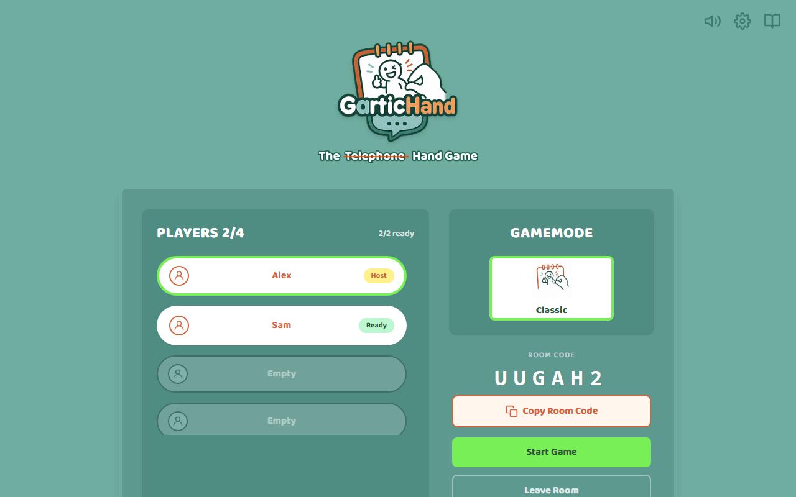
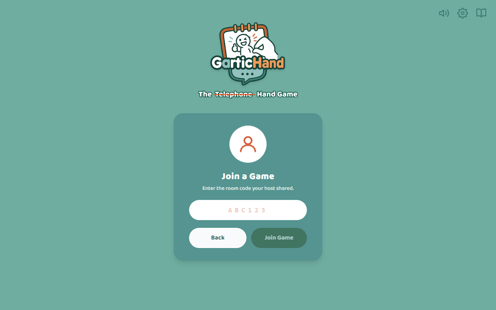
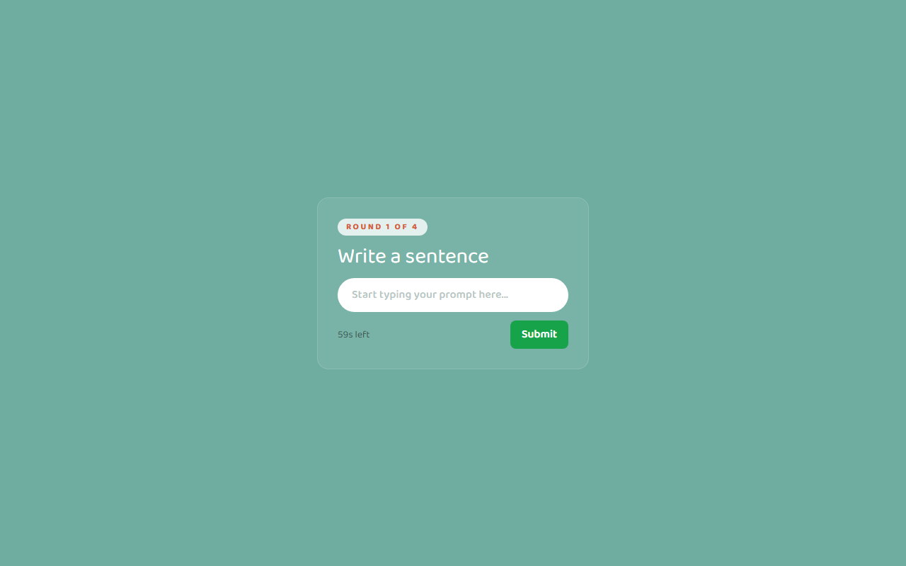
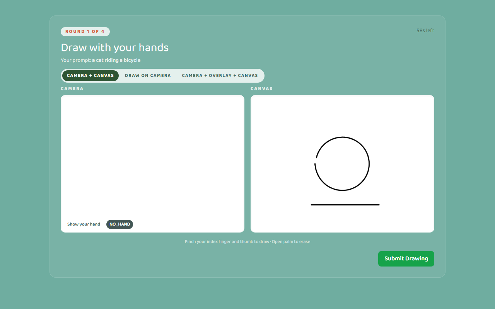
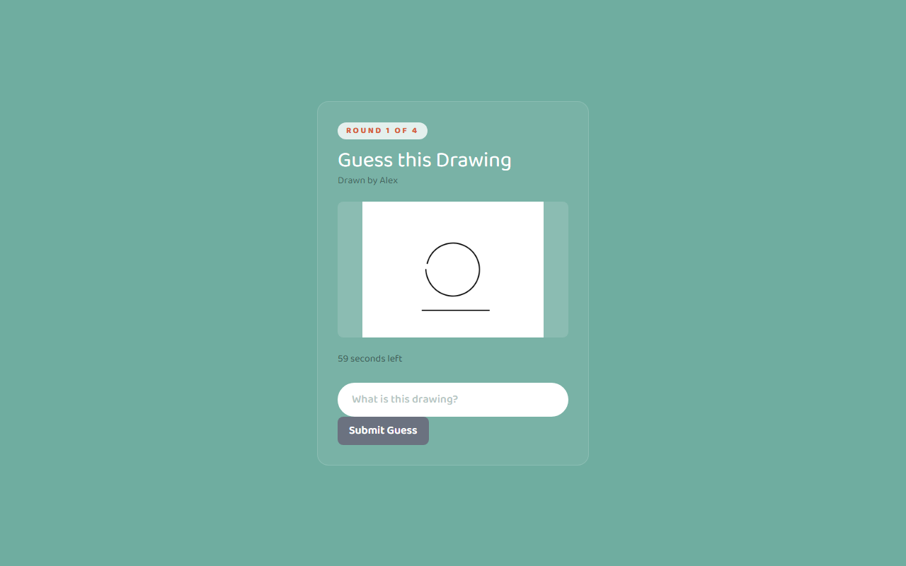
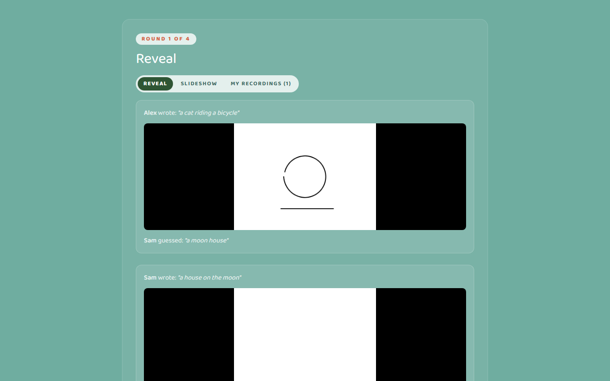
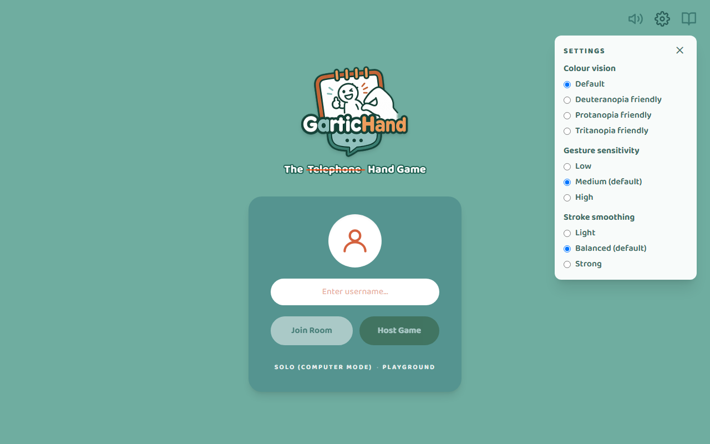

# 🖐️ Gartic Hands — New Player Guide

> **Read time: 5 minutes.** Everything you need to play your first game.
> No mouse, no stylus — you draw in the air with your hand in front of your webcam.

<p align="center">
  
</p>

---

## What is Gartic Hands?

Gartic Hands is a multiplayer **drawing-and-guessing game** in the spirit of *Gartic Phone*
and the telephone game. Everyone writes a sentence, draws someone else's sentence with
**hand gestures tracked by their webcam**, then guesses what someone else drew. At the end
the whole chain — sentence → drawing → guess — is revealed, and it is usually hilarious.

| You need | Details |
| --- | --- |
| A laptop or desktop with a **webcam** | Built-in is fine |
| **Chrome or Edge** | Other browsers are untested |
| **2–4 players** | Each on their own device, or in separate windows |
| Decent light | Tracking works best with your hand clearly lit against a plain background |

---

## Quick start (60 seconds)

```
 Host                                  Everyone else
 ─────────────────────────────────     ─────────────────────────────────
 1. Type a name → Host Game            1. Type a name → Join Room
 2. Copy Room Code → send it to        2. Paste the 6-character code → Join Game
    friends                            3. Press Ready Up
 3. When everyone is ready →
    Start Game
```

Then every player plays the same four steps: **✍️ Write → 🖐️ Draw → 🤔 Guess → 🎉 Reveal.**

---

## Step by step

### 1 · Host or join a room

| Host | Join |
| --- | --- |
|  |  |

- **Host:** enter a name and press **Host Game**. Your lobby shows a 6-character **room code**
  (e.g. `UUGAH2`). Press **Copy Room Code** and share it however you like.
- **Join:** enter a name, press **Join Room**, type the code, press **Join Game**.
- Everyone who joins appears in the **Players** list. Joiners press **Ready Up** to turn their
  badge green; the host is always ready.
- The host's **Start Game** button unlocks only when every player is ready. Anyone can press
  **Leave Room** at any time.

> 💡 A room disappears about a minute after its last player leaves, and whenever the game
> server restarts. If a code stops working, ask the host to create a new room.

### 2 · Write a sentence  ✍️

<p align="center">
  
</p>

Type anything drawable — *"a cat riding a bicycle"*, *"a house on the moon"* — and press
**Submit**. You have **60 seconds**; the timer turns red for the last 10. If the timer runs
out, whatever you typed is submitted for you (an empty box gets a random prompt).

### 3 · Draw with your hands  🖐️

<p align="center">
  
</p>

Your browser will ask for **camera permission** the first time — allow it. Then:

| Gesture | What it does | Tip |
| --- | --- | --- |
| 🤏 **Pinch** index finger and thumb together, then move | **Draws** a line following your index fingertip | Keep the pinch closed while drawing; open it to lift the pen |
| ✋ **Open palm** (all four fingers up) and sweep | **Erases** wherever your hand passes | Small circles work better than big swipes |
| ✋ Hand visible, no gesture | Shows a cursor so you can position before drawing | — |

The pills in the bottom-left corner of the camera view tell you what the game currently
sees — "Show your hand" / "Hand detected", plus the gesture: **NO_HAND**,
**HAND_PRESENT**, **PINCH** or **OPEN_PALM**. If it says NO_HAND, move your hand fully into
frame and towards the light.

Pick a layout with the tabs above the canvas — **Camera + Canvas** (side by side),
**Draw on Camera** (draw straight over your video) or **Camera + Overlay + Canvas**. Press
**Submit Drawing** when you are done, or let the 60-second timer submit it for you.

### 4 · Guess the drawing  🤔

<p align="center">
  
</p>

You are shown **another player's** drawing and who drew it. Type your best guess and press
**Submit Guess** — 60 seconds again.

### 5 · The reveal  🎉

<p align="center">
  
</p>

Once everyone has guessed, the reveal page shows every chain: **who wrote what → what was
drawn → what was guessed**. Three tabs:

- **Reveal** — all chains as cards.
- **Slideshow** — steps through each chain automatically (every 4 seconds), with Prev / Pause /
  Next.
- **My Recordings (N)** — a video replay of *your own* drawing phase, camera picture-in-picture
  included. Recordings stay on your device; nobody else can see them.

The host then presses **Play Round 2** (a game is **4 rounds**), or **Back to Lobby** after
the last one.

---

## Settings  ⚙️

Press the **gear icon** (top-right) on the landing page or in the lobby **before** the game
starts — it is not available on the drawing screen. Every choice is remembered on your
device.

<p align="center">
  
</p>

| Setting | Options | Choose… |
| --- | --- | --- |
| **Colour vision** | Default · Deuteranopia friendly · Protanopia friendly · Tritanopia friendly | …a palette that is easy for you to read |
| **Gesture sensitivity** | Low · **Medium (default)** · High | **High** if pinches are not registering; **Low** if lines start when you did not mean to draw |
| **Stroke smoothing** | Light · **Balanced (default)** · Strong | **Strong** for calmer lines if your hand shakes; **Light** for snappier, more precise control |

---

## Practice modes

From the landing page you can also open:

- **Solo (Computer Mode)** — draw random prompts on your own. A 60-second clock runs for
  pacing, but nothing is submitted when it hits zero. **Save + New Prompt** keeps your
  drawing in an on-page gallery and moves on; **Skip Prompt** moves on without saving.
  Nothing is sent anywhere.
- **Playground** — a free canvas for testing your camera, lighting and gestures before a
  real game. **Snapshot** saves what you drew to an on-screen preview.

Try the Playground first if it is your first time — thirty seconds of practice makes the
real round much more fun.

---

## Troubleshooting

| Problem | Try this |
| --- | --- |
| "Failed to start hand tracking" or a black camera box | Close other apps using the webcam (Zoom, Teams), allow the camera permission in the browser's address bar, then **reload the page** |
| The pill is stuck on **NO_HAND** | Face a light source, keep your whole hand in frame, avoid a busy background |
| Lines appear when you are not pinching | Settings → **Gesture sensitivity: Low** |
| Pinches are being ignored | Settings → **Gesture sensitivity: High**, and pinch more firmly |
| Lines are wobbly | Settings → **Stroke smoothing: Strong** |
| I refreshed the page and got kicked to the start | Expected for now — refreshing leaves the room. Rejoin with the same code; you will sit out the current round and play from the next one |
| I joined and see "Round N is still being played" | You joined mid-round. Wait for the reveal; you are in from the next round |
| The room code says invalid | Codes are 6 letters/numbers; rooms expire a minute after everyone leaves or when the server restarts. Ask for a fresh one |

---

*Made for FIT3170 by the Gartic Hands team · Source and issues:
<https://github.com/Monash-FIT3170/2026W2-GarticHands>*
